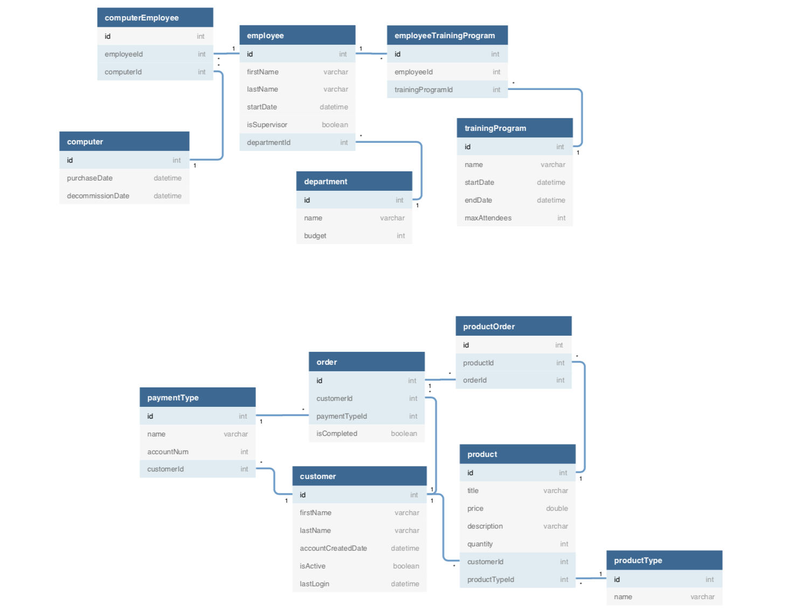

# Bangazon-LLC
This is an API for Bangazon LLC. This API will allow user to GET/POST/PUT and (sometimes) DELETE items from the Bangazon Database. Before you can utilize the database, there are a few things you need to make sure you have installed.

## Link to ERD



# Core Technologies

## SQLite
### Installation of SQLite (if needed)

To get started, type the following command to check if you already have SQLite installed.

```bash
$ sqlite3
```

And you should see:

```
SQLite version 3.7.15.2 2014-08-15 11:53:05
Enter ".help" for instructions
Enter SQL statements terminated with a ";"
sqlite>
```

If you do not see above result, then it means you do not have SQLite installed on your machine. Follow the appropriate instructions below.

#### For Windows

Go to [SQLite Download page](http://www.sqlite.org/download.html) and download the precompiled binaries for your machine. You will need to download `sqlite-shell-win32-*.zip` and `sqlite-dll-win32-*.zip` zipped files.

Create a folder `C:\sqlite` and unzip the files in this folder which will give you `sqlite3.def`, `sqlite3.dll` and `sqlite3.exe` files.

Add `C:\sqlite` to your [PATH environment variable](http://dustindavis.me/update-windows-path-without-rebooting/) and finally go to the command prompt and issue `sqlite3` command.

#### For Mac

First, try to install via Homebrew:

```
brew install sqlite3
```

If not, download the package from above. After downloading the files, follow these steps:

```
$tar -xvzf sqlite-autoconf-3071502.tar.gz
$cd sqlite-autoconf-3071502
$./configure --prefix=/usr/local
$make
$make install
```

#### For Linux

```
sudo apt-get update
sudo apt-get install sqlite3
```

## SQL Browser  - DB Browser

The [DB browser for SQLite](http://sqlitebrowser.org/) will let you view, query and manage your databases during the course.

## Visual Studio Code

[Visual Studio Code](https://code.visualstudio.com/download) is Microsoft's cross-platform editor that we'll be using during orientation for writing Python and building Django applications. Make sure you add the [Python](https://marketplace.visualstudio.com/items?itemName=ms-python.python) extension immediately after installation completes.

## Python

This project uses Python and its web framework Django.

[Python Getting Started](https://www.python.org/about/gettingstarted/)

[Download Python](https://www.python.org/downloads/)

If you are using a Mac, see the [Python for Mac OS X](https://www.python.org/downloads/mac-osx/) page. MacOS 10.2 (Jaguar), 10.3 (Panther), 10.4 (Tiger) and 10.5 (Leopard) already include various versions of Python.

If you're running Windows: the most stable Windows downloads are available from the [Python for Windows](https://www.python.org/downloads/windows/) page.


## Setup Virtual Environment 

Enable a virtual environment at the level above your project.

Use the following commands in your terminal:
```
virtualenv env
source env/bin/activate
```
## Dependencies

Activate your vim and run `pip install -r requirements.txt`

### This Project Uses The Following Dependencies

## Django Project / Django App

Django is a Python Web framework. This project uses Django and requires Python to be installed. See above note on installing Python.

[Django Install](https://docs.djangoproject.com/en/2.1/topics/install/)

[Django for Windows](https://docs.djangoproject.com/en/2.1/howto/windows/)

## Django safedelete
---------------------------------------------------------

[Django safedelete](https://django-safedelete.readthedocs.io/en/latest/)

You can choose what happens when you delete an object :

    * it can be masked from your database (soft delete, the default behavior)

    * it can be masked from your database and mask any dependent models. (cascading soft delete)

    * it can be normally deleted (hard delete)

    * it can be hard-deleted, but if its deletion would delete other objects, it will only be masked

    * it can be never deleted or masked from your database (no delete, use with caution)

**This project uses SOFT_DELETE_CASCADE**

example

```
# imports
from safedelete.models import SafeDeleteModel
from safedelete.models import SOFT_DELETE_CASCADE

# Models

# We create a new model, with the given policy : Objects will be hard-deleted, or soft deleted if other objects would have been deleted too.
class Article(SafeDeleteModel):
    _safedelete_policy = SOFT_DELETE_CASCADE

    name = models.CharField(max_length=100)

class Order(SafeDeleteModel):
    _safedelete_policy = SOFT_DELETE_CASCADE

    name = models.CharField(max_length=100)
    articles = models.ManyToManyField(Article)
```

---------------------------------------------------------

# Installing Bangazon API

As of now, the database is going to be hosted on your local computer. There are a few things you need to make sure are in place before the database can be up and running.

Fork and clone the repo on to you local machine. 

Run makemigrations
`python manage.py makemigrations Website`
Run migrate
`python manage.py migrate`
>This will create all the migrations needed for Django Framework to post items to the database based on the models in the Models/ directory
Create initial SQL data. Nagivate to the Bangazon-LLC directory and run:
`sqlite3 db.sqlite < data.sql`

## Run Server

`python manage.py runserver 8000`
Ctrl+C to quit

## Using the API
For now, all calls to the API will be made from `http://localhost:8000` as the domain. All calls will be made from here. 

### Employees

* GET You can access a list of all employees by running a Get call to `http://localhost:8000/website/employees`
* GET one You can get the information on a single employee by runnning a Get call to `http://localhost:8000/website/employees/{employeeID}`
>Note you need to have a employee unique ID number to get the correct information

* PUT You can update the info on a specific employee by running a Put call to `http://localhost:8000/website/employees/{employeeID}`
    * Running a Put requires that you submit the entire object.
    * Example: `{ "id": 1, "first_name": "Olive", "last_name": "Elayan", "is_supervisor": 1, "department_id": 1}`

* POST You can enter a new payment type by running a Post call to `http://localhost:8000/website/employees/add`

    * You must put a `first_name`, `last_name`, `start_date`, `is_supervisor`, and `department_id` with a Post.
    * Example: `{ "first_name": "Marcy", "last_name": "Elayan", "start_date": "2013-08-16", "is_supervisor": 0, "department_id": 1 }`
    >is_supervisor is an autogenerated field that will set every employee to 0 (not a supervisor) 
    >If you hire a supervisor you can add `"is_supersivor":1` to the POST or change `"is_supervisor":1` in a put later on. 

### Departments

* GET You can access a list of all departments by running a Get call to `http://localhost:8000/website/departments`
* GET one. You can get the information on a single department by runnning a Get call to `http://localhost:8000/website/departments/{departmentID}`
>Note you need to have a department unique ID number to get the correct information

* POST You can enter a new payment type by running a Post call to `http://localhost:8000/website/departments/add`
    * You must put a `department_name` and `budget` with a Post.
    * Example: `{ "department_name": "Practical Uses for Excess Dog Hair", "budget": 8 }`

### Computers

* GET You can access a list of all computers by running a Get call to `http://localhost:8000/website/computers`
* GET one. You can get the information on a single computer by runnning a Get call to `http://localhost:8000/website/computers/{computerID}`
>Note you need to have a computer unique ID number to get the correct information

* DELETE You can delete a computer by running a Delete call to `http://localhost:8000/website/computers/delete/{computerID}`

* POST You can enter a new computer by running a Post call to `http://localhost:8000/website/computers/add`
    * You must put a `manufacturer`, `model`, and `purchase_date` with a Post.
    * Example: `{ "manufacturer": "Wales", "model": "Pembroke",  "purchase_date": "2012-02-24" }`

### Training Programs

* GET You can access a list of all training programs by running a Get call to `http://localhost:8000/website/training`
* GET one. You can get the information on a single training program by runnning a Get call to `http://localhost:8000/website/training/{trainingprogramID}`
>Note you need to have a training program unique ID number to get the correct information

* POST You can enter a new training program by running a Post call to `http://localhost:8000/website/training/add`
    * You must put a `program_name`, `program_desc`, `start_date`, `end_date`, and `max_attendees` with a Post.
    * Example: `{ "program_name": "Being Better Dogs for Our Master", "program_desc": "We Will Explore Ways to Not Throw Up on Expensive Items", "start_date": "2019-01-31", "end_date": "2019-02-01", "max_attendees": 6 }`


This repo created by the Talkative Tangs of Cohort 28:

[Bryan Nilsen](https://github.com/BryanNilsen): Training Programs Module - Team Lead

[Lesley Boyd](https://github.com/laboyd001): Computers Module

[Ousama Elayan](https://github.com/ousamasama/): Departments Module

[Elyse Dawson](https://github.com/CurtainUp): Employees Module
